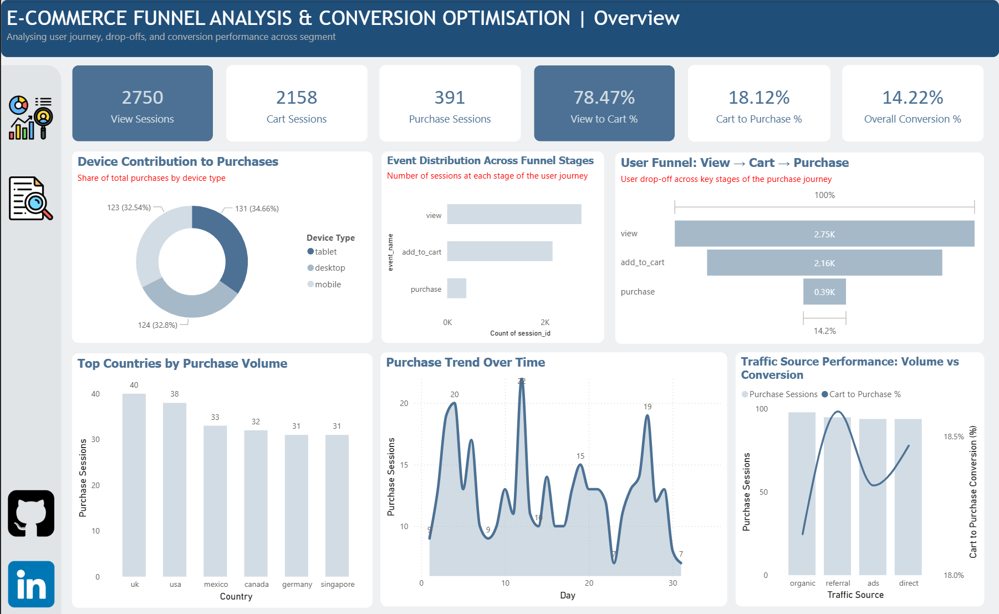
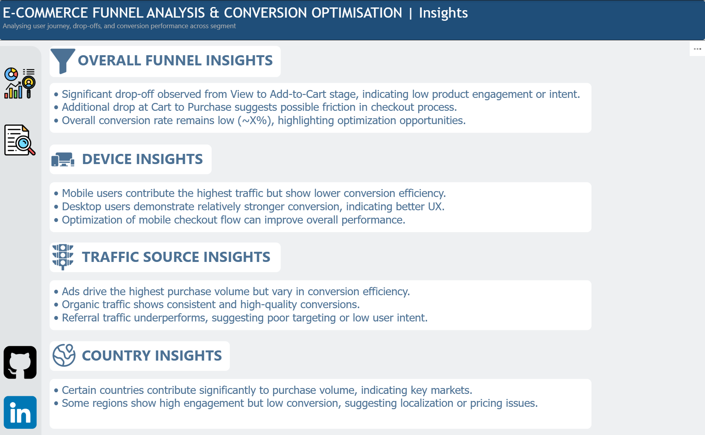
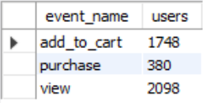
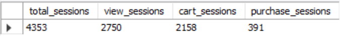
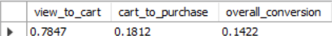
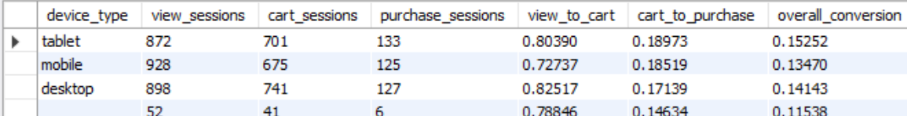
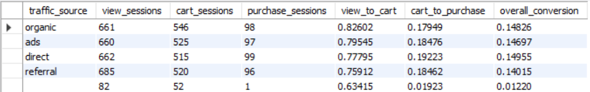
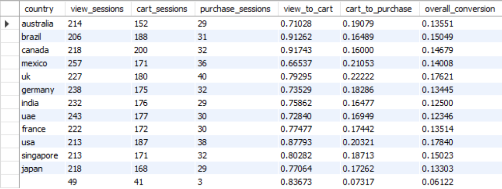

# 📊 E-commerce Funnel Analysis & Conversion Optimization

This project performs an end-to-end **Funnel Analysis** on e-commerce user behavior data to identify drop-offs, measure conversion rates, and uncover actionable insights for business optimization.

---

# 🖼️ Dashboard Preview

## 📌 Main Dashboard


## 📌 Insights Page


---

# 🎯 Project Objective

The goal of this project is to:

- Analyze user journey across funnel stages  
- Identify **drop-off points**  
- Measure **conversion rates**  
- Evaluate performance across:
  - Device types  
  - Traffic sources  
  - Countries  
- Provide **business recommendations**

---

# 🧱 Project Workflow

## 1️⃣ Data Generation
- Generated a **large, messy dataset (~20K+ rows)** simulating real-world e-commerce tracking
- Included:
  - Missing values  
  - Inconsistent event names  
  - Noise events  
  - Mixed data types  

---

## 2️⃣ Data Cleaning (Python)

Performed using:
- **Pandas**
- **NumPy**

### Key Steps:
- Fixed data types (timestamp, price, user_id)
- Handled missing values (critical vs non-critical)
- Standardized event names:
  - `view`, `add_to_cart`, `purchase`
- Removed noise events
- Cleaned categorical columns (device, traffic, country)
- Ensured data consistency

---

## 3️⃣ Funnel Analysis (Python)

- Built **user-level and session-level funnels**
- Calculated:
  - Conversion rates  
  - Drop-offs  
- Segmented analysis by:
  - Device  
  - Traffic source  
  - Country  

---

## 4️⃣ SQL Analysis (MySQL)

Recreated full funnel logic using SQL:

### Key Concepts Used:
- Conditional aggregation (`CASE WHEN`)
- Session-level grouping
- Conversion calculations

---

## 📸 SQL Analysis Snapshots

### Users Reaching Each Stage


### Session Count


### Session-Level Conversion Rates


### Funnel by Device


### Funnel by Traffic Source


### Funnel by Country


---

## 5️⃣ Dashboard (Power BI)

Built an **interactive dashboard** to visualize:

### Key Components:
- KPI Cards:
  - Total Sessions  
  - Conversion Rates  
- Funnel Chart (core visual)
- Device Analysis (Donut Chart)
- Traffic Analysis (Combo Chart: Volume + Conversion)
- Country Analysis
- Time Trend (Line Chart)
- Insights Page (business conclusions)

---

# 📊 Key Insights

- Significant drop-off occurs at **View → Add to Cart stage**
- Checkout stage also shows **conversion friction**
- **Mobile drives high traffic** but slightly lower efficiency
- **Ads generate high volume**, while **organic shows better quality**
- Certain countries outperform others, indicating **market opportunities**

---

# 🛠️ Tech Stack

| Layer | Tools |
|------|------|
| Data Cleaning | Python (Pandas, NumPy) |
| Analysis | Python + SQL (MySQL) |
| Visualization | Power BI |
| Development | Jupyter Notebook (Antigravity IDE) |
| Data | CSV (Messy simulated dataset) |

---

# 📁 Project Structure

```plaintext
Funnel-Analysis/
│
├── data/
│   ├── raw/
│   │   └── raw_data.csv
│   │
│   └── processed/
│       └── cleaned_data.csv
│
├── notebooks/
│   └── funnel_analysis.ipynb
│
├── sql/
│   └── funnel_queries.sql
│
├── dashboard/
│   └── funnel_dashboard.pbix
│
├── screenshots/
│   ├── DASHBOARD.png
│   └── INSIGHTS.png
│
├── insights/
│   ├── funnel_by_country.png
│   ├── funnel_by_device_type.png
│   ├── funnel_by_traffic_source.png
│   ├── session_count.png
│   ├── session_level_conversion_rate.png
│   └── users_reached_each_stage.png
│
├── docs/
│   └── project_overview.md
│
├── README.md
└── requirements.txt
```

---

# 🚀 How to Run

1. Run Jupyter Notebook for data cleaning & analysis  
2. Import cleaned CSV into MySQL  
3. Execute SQL queries  
4. Load data into Power BI  
5. Build dashboard  

---

# 🧠 Skills Demonstrated

- Data Cleaning & Preprocessing  
- Exploratory Data Analysis  
- Funnel Analysis  
- SQL (Intermediate → Advanced)  
- Data Visualization  
- Business Insight Generation  

---

# 👤 Author

**Lakshya Sharma**  
🔗 LinkedIn: https://www.linkedin.com/in/slakshya22/